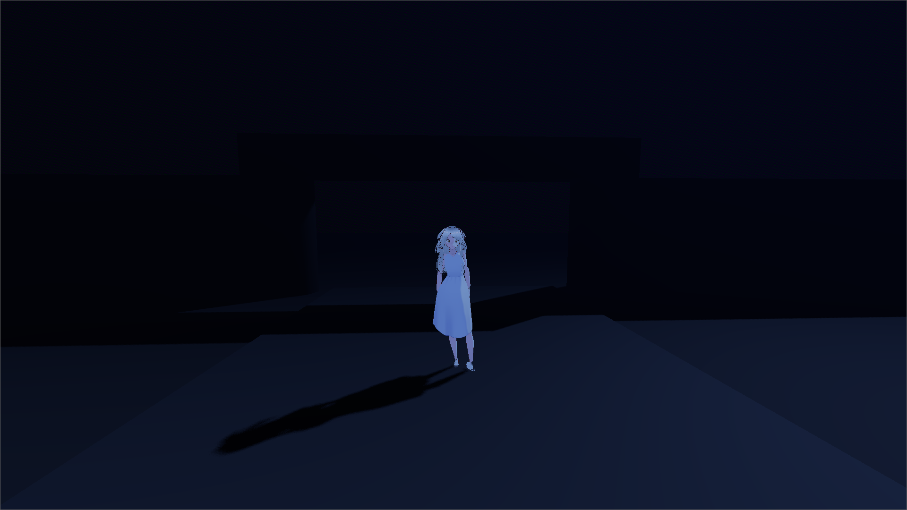

# Moonlit Void - Nocturnal Roaming Project

## Technical Stack
- **Engine:** Godot Engine 4.6.x (or 4.x compatible)
- **Language:** GDScript
- **Renderer:** Forward+ (Direct3D 12 / Vulkan)
- **Pipeline:** 100% Headless via CLI (no graphical editor interface)

## Current State

## CLI Commands (Headless Pipeline)
All commands must be executed at the root of the project from the Windows command prompt. You can use the `pipeline_headless.bat` file or run them manually:

1. **Import assets (generates .import files):**
   `godot4 --headless --path . --import`
2. **Validate the main scene (checks for script errors):**
   `godot4 --headless --path . res://scenes/main.tscn --quit-after 5`
3. **Export the game (Windows .exe):**
   `godot4 --headless --path . --export-release "Windows Desktop" build/jeu.exe`

## Running the game
Run `build/jeu.exe` on Windows 11.
- The game launches in full screen without a menu.
- Controls: WASD/ZQSD or Arrow keys.
- Esc to quit.
